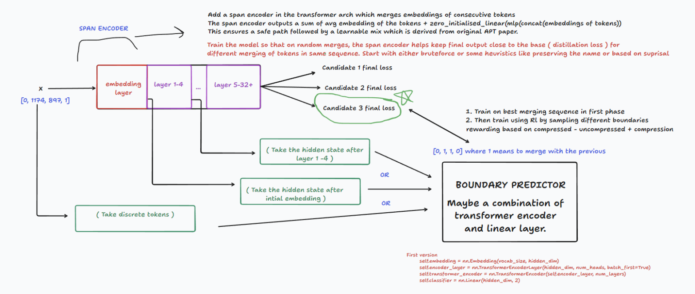

<div align="center">

<h1>Adaptive Tokenization</h1>

<p><strong>Post training models for dynamic semantic tokenization</strong></p>

<p>
  <a href="https://wandb.ai/highattacker/adaptive-tokenization">Wandb</a>
  &nbsp;&middot;&nbsp;
  <a href="https://huggingface.co/datasets/Open-Orca/OpenOrca">ORCA</a>
  &nbsp;&middot;&nbsp;
  <a href="https://huggingface.co/buckets/manan05/adaptive-tokenization">Hugging Face Artifacts Bucket</a>

</p>


</div>

Tokenization is a long standing problem even more so now with coding agents which need to read a large number of files and retain quite a lot of information. **The question which comes up with this is that do we really need to represent every single token as its own or there is a way to reduce the input sequence length by merging semantically?** 

Several works have been published on these lines of representing tokenization in a couple of different ways. [Byte Latent Transformer](https://arxiv.org/abs/2412.09871) showed that byte level models can group bytes based on entropy and combined with local n gram features, can even scale under FLOP controlled study. [H-Net](https://arxiv.org/abs/2507.07955) learns context dependent hierarchical chunking strategies using a unet style architecture but the architecture becomes very complex very quickly which breaks the inductive bias of tokenization in training very early, more on that later. [You can learn tokenization end to end with RL](https://arxiv.org/abs/2602.13940) improves upon H-Net by learning tokenization boundaries using RL and uses a lot of bias removing strategies that comes with using RL however it uses a false early exit baseline and has a lot of moving parts which is shaped by hyperparameters. [Retrofitting Large Language Models with Dynamic Tokenization
](https://arxiv.org/abs/2411.18553) show that we can adapt models after pretraining for dynamic tokenization however they only merge local frequency patterns and do not do any kind of semantic merging. [Compute Optimal Tokenization
](https://arxiv.org/abs/2605.01188) is a latest paper by META showing a comparison of tokenization along the lines of bytes and compression rate. However a globally optimal compression still leaves room for local merging. 

All except one paper out of the above learn or evaluate tokenization from pretraining. However coming back to inductive bias, tokenization plays a major role for LLM training in the earliest stage. When weights are randomly initialised and there is no way for LLM to know what is going on, BPE helps LLMs to recover some of the inductive bias about how to group things together, what comes next and so on. Trying to learn tokenization from scratch leads to asking your model to do so much at once that it wouldn't scale. Instead what if we take a pretrained LLM and by post training allow our model to handle dynamically merged input tokens. However adding more parameters leads to disproportionate evaluation due to different FLOPS. 

**The goal is to find a way for dynamic tokenization to work such that it remains approximately compute equivalent at scale at least during inference. This forms the premise of our project leading to Adaptive Tokenization.**

## Introduction and Methodology

Recently a paper was released in the domain of Computer Vision called [Accelerating Vision Transformers with Adaptive Patch Sizes
](https://arxiv.org/abs/2510.18091). It introduced Adaptive Patch Transformers (APT), which addresses this by using multiple different patch sizes within the same image which in turn 
reduces the total number of input tokens by allocating larger patch sizes in more
homogeneous areas and smaller patches in more complex ones. The motivation for this project was if such a thing could work in vision, there is usually a chance that it could transfer to other modalities as well. The paper proposes a method to merge patches using entropy ( it works in vision due to continuous data ) and proposes a Zero initialised MLP path followed by a safe path. It helps to preserve high-resolution details without initially degrading performance, facilitating faster convergence
during fine-tuning. This specifically enables APT to be applied to any pre-trained ViT and matches
the performance of the initial model with a single epoch of accelerated fine-tuning. 

We decided to use the concept behind this and apply it to this project. The initial methodology is depicted in the Figure 2 below.

- In the first step we retrofit an existing LLM ( GPT-2 Small 124M ) model by adding a minimal span encoder ( 7M ) which merges embeddings of nearby tokens as per

    Average(Token Embeddings) + Zero_Linear(MLP(Concat(Token Embeddings)))

    The model is trained at varying random compression levels to make it robust to merged embeddings in the input. The compression follows a loose cosine warmup schedule which forms the floor of the actual compression (0% compression for first 10% of training, cosine ramp to 70% over 10-90%, constant at 70% for final 10%.). A naive model and a adaptive model both are trained on same no. of steps and tokens to form a comparative analysis of the two.

The post training and evaluation is done on ORCA dataset with 98M tokens during the training phase.

- Now that the model is better with compressed embeddings, we need to train a boundary predictor to select the best boundaries which keeps loss as close as to the base model as possible. However before that, we ran a quick sweep across compression levels and loss values and two different sequence lengths. To our surprise when plotted the average loss, we can see that at an optimal compression, the model has capacity to outperform its naive counterpart.


Figure 1: Sweep of Adaptive Compression


| Metric | 96-token prompt | 384-token prompt |
|--------|----------------|------------------|
| Naive no-merge | 5.26 | 4.51 |
| Adaptive no-merge | 5.35 | 4.54 |
| **Adaptive best (with compression)** | **4.96 (cr=67%)** | **4.04 (cr=65%)** |
| Gain vs Naive | **+5.8% better** | **+10.3% better** |

Key finding from this experiment was that smartly compressing the input can *beat* no compression. Compression acts as a noise filter, improving prediction signal. Green zone extends to at least 65-70%.

- To exploit this, we train a boundary predictor in 3 steps. First we collect a lot of cold start data by passing K=128 different variants of a single sequence to the model and finding the configuration which leads to the lowest loss. Then training the boundary predictor with this cold start data. Finally, training our boundary predictor in an online setting using GRPO by sampling 4 different boundary decisions for every sequence and rewarding based on a mix of final loss and compression achieved. As we can see in the examples, post-RL the model learns much better semantic boundaries for the same sequence. 

We also tried directly performing RL on the boundary predictor however due to a large action space and sparse credit assignment, it collapses into zero advantage whereas after cold starting, the advantage remains considerably high throughout which we can see in the wandb logs attached.
 

Figure 2: Architecture diagram for Adaptive Tokenization

**Note: We acknowledge that the better loss can be because of additional parameters of span encoder and would therefore try to find the least parameter inducing span encoder which leads to equivalent results at different sizes of parameters** 

## Evaluation

| Model | No Merge (loss/ppl/bpb) | Random Merge (loss/ppl/bpb) | CORE ↓ |
|-------|------------------------|-----------------------------|--------|
| **Naive** | 1.456 / 4.29 / 2.10 | 1.814 / 6.13 / 2.62 | 1.245 |
| **Adaptive** | 1.530 / 4.62 / 2.21 | 1.630 / 5.10 / 2.35 | **1.065** |

CORE = merged_loss / no_merge_loss. Lower = less degradation. Adaptive reduces compression penalty from 24.5% → 6.5%.

### Pre vs Post Training of boundary predictor

| Method | Compression | Loss | CORE |
|--------|------------|------|------|
| No-merge baseline | 0% | 1.372 | 1.000 |
| Random merge | 9% | 1.386 | 1.010 |
| **BCE-only (imitation)** | **60%** | **1.422** | **1.036** |
| **BCE + GRPO (hybrid)** | **66%** | **1.360** | **0.991** |

**CORE < 1.0** - The GRPO fine-tuned predictor achieves *better* quality than no compression while using 66% fewer prompt tokens. Compression improves predictions.

**BCE-only vs GRPO**: BCE alone is CORE=1.036 (worse than no-merge). GRPO flips it to CORE=0.991. The predictor learns to be more aggressive (60% → 66% cr) while also improving quality.

## What Merging Looks Like

Each block is a **merged span** and everything inside one block gets packed into a single embedding.

**Example 1** — *"force of attraction"* (cr=39% vs 75%):

> <span style="background:#ffcccb;color:#000;padding:1px 3px">Q</span>|<span style="background:#cce5ff;color:#000;padding:1px 3px">: What is</span>|<span style="background:#ffcccb;color:#000;padding:1px 3px"> the</span>|<span style="background:#cce5ff;color:#000;padding:1px 3px"> force</span>|<span style="background:#ffcccb;color:#000;padding:1px 3px"> of</span>|<span style="background:#cce5ff;color:#000;padding:1px 3px"> attraction</span>|<span style="background:#ffcccb;color:#000;padding:1px 3px"> that</span>|<span style="background:#cce5ff;color:#000;padding:1px 3px"> holds together positive and</span>|<span style="background:#ffcccb;color:#000;padding:1px 3px"> negative</span>|<span style="background:#cce5ff;color:#000;padding:1px 3px"> ions</span>|<span style="background:#ffcccb;color:#000;padding:1px 3px">?</span>
> `BCE-only` - nearly word-by-word (34 total spans)

> <span style="background:#ffcccb;color:#000;padding:1px 3px">Q: What is</span>|<span style="background:#cce5ff;color:#000;padding:1px 3px"> the force of attraction</span>|<span style="background:#ffcccb;color:#000;padding:1px 3px"> that holds together positive</span>|<span style="background:#cce5ff;color:#000;padding:1px 3px"> and negative ions</span>|<span style="background:#ffcccb;color:#000;padding:1px 3px">?</span>
> `BCE+GRPO` - coherent phrases (14 total spans)

**Example 2** — *"Tower of London / Richard II"* (cr=45% vs 74%):

> <span style="background:#ffcccb;color:#000;padding:1px 3px">Q:Found the</span>|<span style="background:#cce5ff;color:#000;padding:1px 3px"> following article online</span>|<span style="background:#ffcccb;color:#000;padding:1px 3px">, use</span>|<span style="background:#cce5ff;color:#000;padding:1px 3px"> it</span>|<span style="background:#ffcccb;color:#000;padding:1px 3px"> to</span>|<span style="background:#cce5ff;color:#000;padding:1px 3px"> answer</span>|<span style="background:#ffcccb;color:#000;padding:1px 3px"> the</span>|<span style="background:#cce5ff;color:#000;padding:1px 3px"> question</span>|<span style="background:#ffcccb;color:#000;padding:1px 3px">: What was</span>|<span style="background:#cce5ff;color:#000;padding:1px 3px"> the full name</span>|<span style="background:#ffcccb;color:#000;padding:1px 3px"> of the location</span>|<span style="background:#cce5ff;color:#000;padding:1px 3px"> where Richard II</span>|<span style="background:#ffcccb;color:#000;padding:1px 3px"> began his procession?</span>
> `BCE-only` - splinters into tiny pieces (211 total spans)

> <span style="background:#ffcccb;color:#000;padding:1px 3px">Q:Found the following article</span>|<span style="background:#cce5ff;color:#000;padding:1px 3px">, use it to answer the question</span>|<span style="background:#ffcccb;color:#000;padding:1px 3px">: What was the full name of the</span>|<span style="background:#cce5ff;color:#000;padding:1px 3px"> location where Richard II began his procession?</span>
> `BCE+GRPO` - merges into meaningful chunks (99 total spans)

**Example 3** — *"National Hockey League"* (cr=48% vs 74%):

> <span style="background:#ffcccb;color:#000;padding:1px 3px">Please answer the following</span>|<span style="background:#cce5ff;color:#000;padding:1px 3px"> question: Information:</span>|<span style="background:#ffcccb;color:#000;padding:1px 3px"> - The National</span>|<span style="background:#cce5ff;color:#000;padding:1px 3px"> Hockey</span>|<span style="background:#ffcccb;color:#000;padding:1px 3px"> League</span>|<span style="background:#cce5ff;color:#000;padding:1px 3px"> (NHL)</span>|<span style="background:#ffcccb;color:#000;padding:1px 3px"> is a professional ice hockey league</span>|<span style="background:#cce5ff;color:#000;padding:1px 3px"> currently composed of 31 member clubs.</span>
> `BCE-only` - breaks "Hockey" and "League" apart (201 total spans)

> <span style="background:#ffcccb;color:#000;padding:1px 3px">Please answer the following question:</span>|<span style="background:#cce5ff;color:#000;padding:1px 3px"> Information: - The National Hockey League (NHL)</span>|<span style="background:#ffcccb;color:#000;padding:1px 3px"> is a professional ice hockey league</span>|<span style="background:#cce5ff;color:#000;padding:1px 3px"> currently composed of 31 member clubs.</span>
> `BCE+GRPO` - keeps "National Hockey League (NHL)" together (101 total spans)

## Reproduction

```bash
# Phase 1
modal run --detach modal_app.py::train_naive_fn
modal run --detach modal_app.py::train_adaptive_fn
modal run --detach modal_app.py::evaluate_fn
modal run --detach modal_app.py::oracle_fn

# Phase 2
modal run --detach phase2_app.py::train_hybrid_fn
modal run --detach phase2_app.py::evaluate_hybrid_fn
```

## Next Steps

- Ablation of architecture of span encoder and keeping additional parameter size negligible compared to the base model
- Running FLOP controlled inference tests to find the true speedup.
- Scaling it to more tokens during the post training and also trying the same strategy on an already sharpened (post trained) model.
- Training the boundary predictor most extensively to handle out of domain tasks during test time and evaluating cross domain generalisation.

**We have also open sourced our wandb logs and checkpoints artifacts for reproducibility. Further experiments will be added to the same links. All experiments are tracked by timestamp and commit ids.**