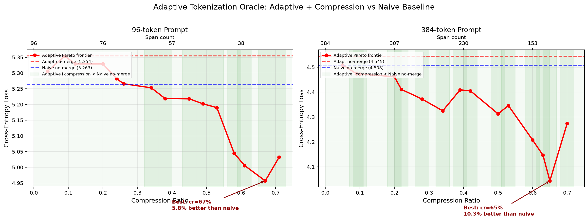

# Adaptive Tokenization

Post-training models to handle variable token granularity via span compression tracking.

## Concept

Standard tokenization is fixed — every token gets its own embedding. **Adaptive tokenization** lets the model merge nearby tokens into "spans" at runtime, reducing sequence length while preserving information.

We insert a lightweight **SpanEncoder** between the embedding layer and transformer. It groups token embeddings into spans and merges them into single representations. The model then processes fewer positions, trading granularity for context capacity.

```
Standard:  [E0] [E1] [E2] [E3] [E4] [E5] ... → Transformer → LM Head
Adaptive:  [E0,E1] [E2] [E3,E4,E5] ... → SpanEncoder → [S0] [S1] [S2] ... → Transformer → LM Head
```

- **SpanEncoder**: Mean pooling + zero-initialized MLP residual (~7M params). Starts near-identity, learns to merge.
- **Compression curriculum**: 0% compression for first 10% of training, cosine ramp to 70% over 10-90%, constant at 70% for final 10%.
- **Loss**: Standard autoregressive cross-entropy on answer tokens only (prompt compression = preprocessing).
- **Dataset**: [Open-Orca/OpenOrca](https://huggingface.co/datasets/Open-Orca/OpenOrca) — instruction/response pairs.
- **Tracking**: Full [Weights & Biases](https://wandb.ai/highattacker/adaptive-tokenization) logging: training curves, eval metrics, oracle frontiers, merge visualization tables.
- **Reproducibility**: Seed=42 fixed across all runs. Git commit `d4fa4a9`. Experiment ID `exp-YYYYMMDD-HHMMSS-g{commit}`.

## Phase 1: SpanEncoder Training

**Setup**: GPT-2 small (124M + 7M SpanEncoder), 100M tokens, 6000 steps, A100-80GB, bf16 mixed precision.

**Naive (V1)**: Standard GPT-2 fine-tuning on OpenOrca. Loss on answer tokens only. No compression.
**Adaptive (V2)**: Same but with SpanEncoder compressing the prompt via curriculum schedule.

### Evaluation

| Model | No Merge (loss/ppl/bpb) | Random Merge (loss/ppl/bpb) | CORE ↓ |
|-------|------------------------|-----------------------------|--------|
| **Naive** | 1.456 / 4.29 / 2.10 | 1.814 / 6.13 / 2.62 | 1.245 |
| **Adaptive** | 1.530 / 4.62 / 2.21 | 1.630 / 5.10 / 2.35 | **1.065** |

CORE = merged_loss / no_merge_loss. Lower = less degradation. Adaptive reduces compression penalty from 24.5% → 6.5%.

**Training curves** (wandb): loss drops smoothly for both models. Adaptive shows `cr_actual` converging toward `cr_schedule` as curriculum progresses.

### Oracle Analysis

Brute-force sampled configurations across compression ratios to find the loss-compression Pareto frontier.



| Metric | 96-token prompt | 384-token prompt |
|--------|----------------|------------------|
| Naive no-merge | 5.26 | 4.51 |
| Adaptive no-merge | 5.35 | 4.54 |
| **Adaptive best (with compression)** | **4.96 (cr=67%)** | **4.04 (cr=65%)** |
| Gain vs Naive | **+5.8% better** | **+10.3% better** |

Key finding: Smart compression can *beat* no compression — the SpanEncoder acts as a noise filter, improving prediction signal. Green zone extends to cr≈65-70%.

---

## Phase 2: Learned Boundary Prediction (Hybrid RL) ✅

**Done**: Trained a BoundaryPredictor (~2M params) via hybrid 3-stage RL to decide which tokens to merge at inference.

**Architecture**: Shared GPT-2 embedding (frozen), 1-layer transformer encoder (dim=256, 4 heads), MLP head → sigmoid per position. ~2M trainable params.

### 3-Stage Training

1. **Oracle Dataset (Stage 1)**: Sample K=128 random boundary configs per prompt. Score all via frozen Adaptive model. Keep best (reward = -loss + 0.3 × cr). Store 1000 (prompt, best_boundaries) pairs.

2. **Supervised Imitation (Stage 2)**: BCE loss — train predictor to predict oracle boundaries. 5 epochs, batch=32. Gives the predictor a strong initialization.

3. **GRPO Fine-tuning (Stage 3)**: Online RL starting from imitation checkpoint. 2000 steps, group size 16, 4 samples per prompt. Reward = -loss + 0.3 × cr.

### Results

| Method | Compression | Loss | CORE |
|--------|------------|------|------|
| No-merge baseline | 0% | 1.372 | 1.000 |
| Random merge | 9% | 1.386 | 1.010 |
| **BCE-only (imitation)** | **60%** | **1.422** | **1.036** |
| **BCE + GRPO (hybrid)** | **66%** | **1.360** | **0.991** |

**CORE < 1.0** — the GRPO fine-tuned predictor achieves *better* quality than no compression while using 66% fewer prompt tokens. Compression improves predictions.

**BCE-only vs GRPO**: BCE alone is CORE=1.036 (worse than no-merge). GRPO flips it to CORE=0.991 — the RL step matters. The predictor learns to be more aggressive (60% → 66% cr) while improving quality.

### What Merging Looks Like

Each colored block is a **merged span** — everything inside one block gets packed into a single embedding. Pink and blue alternate to show where one span ends and the next begins. Both versions cover the **identical text**, making boundary differences immediately visible.

**Example 1** — *"force of attraction"* (cr=39% vs 75%):

> <span style="background:#ffcccb;color:#000;padding:1px 3px">Q</span><span style="background:#cce5ff;color:#000;padding:1px 3px">: What is</span><span style="background:#ffcccb;color:#000;padding:1px 3px"> the</span><span style="background:#cce5ff;color:#000;padding:1px 3px"> force</span><span style="background:#ffcccb;color:#000;padding:1px 3px"> of</span><span style="background:#cce5ff;color:#000;padding:1px 3px"> attraction</span><span style="background:#ffcccb;color:#000;padding:1px 3px"> that</span><span style="background:#cce5ff;color:#000;padding:1px 3px"> holds together positive and</span><span style="background:#ffcccb;color:#000;padding:1px 3px"> negative</span><span style="background:#cce5ff;color:#000;padding:1px 3px"> ions</span><span style="background:#ffcccb;color:#000;padding:1px 3px">?</span>
> `BCE-only` — nearly word-by-word (34 total spans)

> <span style="background:#ffcccb;color:#000;padding:1px 3px">Q: What is</span><span style="background:#cce5ff;color:#000;padding:1px 3px"> the force of attraction</span><span style="background:#ffcccb;color:#000;padding:1px 3px"> that holds together positive</span><span style="background:#cce5ff;color:#000;padding:1px 3px"> and negative ions</span><span style="background:#ffcccb;color:#000;padding:1px 3px">?</span>
> `BCE+GRPO` — coherent phrases (14 total spans)

**Example 2** — *"Tower of London / Richard II"* (cr=45% vs 74%):

> <span style="background:#ffcccb;color:#000;padding:1px 3px">Q:Found the</span><span style="background:#cce5ff;color:#000;padding:1px 3px"> following article online</span><span style="background:#ffcccb;color:#000;padding:1px 3px">, use</span><span style="background:#cce5ff;color:#000;padding:1px 3px"> it</span><span style="background:#ffcccb;color:#000;padding:1px 3px"> to</span><span style="background:#cce5ff;color:#000;padding:1px 3px"> answer</span><span style="background:#ffcccb;color:#000;padding:1px 3px"> the</span><span style="background:#cce5ff;color:#000;padding:1px 3px"> question</span><span style="background:#ffcccb;color:#000;padding:1px 3px">: What was</span><span style="background:#cce5ff;color:#000;padding:1px 3px"> the full name</span><span style="background:#ffcccb;color:#000;padding:1px 3px"> of the location</span><span style="background:#cce5ff;color:#000;padding:1px 3px"> where Richard II</span><span style="background:#ffcccb;color:#000;padding:1px 3px"> began his procession?</span>
> `BCE-only` — splinters into tiny pieces (211 total spans)

> <span style="background:#ffcccb;color:#000;padding:1px 3px">Q:Found the following article</span><span style="background:#cce5ff;color:#000;padding:1px 3px">, use it to answer the question</span><span style="background:#ffcccb;color:#000;padding:1px 3px">: What was the full name of the</span><span style="background:#cce5ff;color:#000;padding:1px 3px"> location where Richard II began his procession?</span>
> `BCE+GRPO` — merges into meaningful chunks (99 total spans)

**Example 3** — *"National Hockey League"* (cr=48% vs 74%):

> <span style="background:#ffcccb;color:#000;padding:1px 3px">Please answer the following</span><span style="background:#cce5ff;color:#000;padding:1px 3px"> question: Information:</span><span style="background:#ffcccb;color:#000;padding:1px 3px"> - The National</span><span style="background:#cce5ff;color:#000;padding:1px 3px"> Hockey</span><span style="background:#ffcccb;color:#000;padding:1px 3px"> League</span><span style="background:#cce5ff;color:#000;padding:1px 3px"> (NHL)</span><span style="background:#ffcccb;color:#000;padding:1px 3px"> is a professional ice hockey league</span><span style="background:#cce5ff;color:#000;padding:1px 3px"> currently composed of 31 member clubs.</span>
> `BCE-only` — breaks "Hockey" and "League" apart (201 total spans)

> <span style="background:#ffcccb;color:#000;padding:1px 3px">Please answer the following question:</span><span style="background:#cce5ff;color:#000;padding:1px 3px"> Information: - The National Hockey League (NHL)</span><span style="background:#ffcccb;color:#000;padding:1px 3px"> is a professional ice hockey league</span><span style="background:#cce5ff;color:#000;padding:1px 3px"> currently composed of 31 member clubs.</span>
> `BCE+GRPO` — keeps "National Hockey League (NHL)" together (101 total spans)

**Key insight**: BCE learns conservative boundaries (every word its own span), while GRPO learns to merge coherent phrases including punctuation and parentheticals. Despite 2-3x fewer spans across all examples, GRPO achieves **better prediction quality** (CORE=0.991 vs 1.036). Compression is not just about saving tokens — it can improve the signal when applied intelligently.

### Why Hybrid Works

- Pure GRPO failed because Bernoulli sampling from a sigmoid head collapses to deterministic output → zero advantage → no gradient
- Stage 1 guarantees diversity (random sampling) and creates a strong supervised signal
- Stage 2 teaches the predictor what "good" boundaries look like
- Stage 3 fine-tunes from good layouts, maintaining enough variance for RL to work

## Metrics

| Metric | Meaning |
|--------|---------|
| **loss** | Cross-entropy on answer tokens (lower = better) |
| **ppl** | Perplexity = e^loss. Effective "branching factor" |
| **bpb** | Bits per byte = loss / ln(2). Encoding efficiency |
| **CORE** | Compression ratio error = merged_loss / no_merge_loss. < 1.0 = compression improves quality |

## Project Structure

```
adaptive_tokenization/
├── src/
│   ├── tracker.py            # Wandb experiment tracker + reproducibility utils
│   ├── span_encoder.py       # SpanEncoder: merges token groups
│   ├── merging.py            # Random span boundary generation
│   ├── data.py               # OpenOrca dataset (prompt/answer splits)
│   ├── model.py              # AdaptiveGPT2Model with forward_chat
│   ├── train.py              # V1 (naive) and V2 (adaptive) training loops
│   ├── evaluate.py           # Dual-scenario evaluation
│   ├── boundary_predictor.py # Phase 2: learned boundary predictor
│   ├── boundary_sampling.py  # Phase 2: sampling with logit biases
│   └── hybrid_train.py       # Phase 2: 3-stage training (oracle → BCE → GRPO)
├── modal_app.py              # Phase 1 Modal orchestration
├── phase2_app.py             # Phase 2 Modal orchestration
├── oracle_dual_v2.png        # Oracle analysis plot
├── plot_oracle.py            # Plot generation script
├── artifacts_v2/             # Downloaded checkpoints (13 GB)
├── README.md
└── EXPERIMENTS.md            # Detailed experiment log
```

## Running

```bash
# Phase 1
modal run --detach modal_app.py::train_naive_fn
modal run --detach modal_app.py::train_adaptive_fn
modal run --detach modal_app.py::evaluate_fn
modal run --detach modal_app.py::oracle_fn

# Phase 2
modal run --detach phase2_app.py::train_hybrid_fn
modal run --detach phase2_app.py::evaluate_hybrid_fn
```

Runs on Modal cloud with A100-80GB GPU. All metrics logged to wandb under group `exp-{timestamp}-g{commit}`.

## Next Steps

1. **Scale tokens** — 100M → 1B tokens to close the Adaptive/Naive no-merge gap
2. **Ablate curriculum** — compare constant compression vs ramping schedule
3. **Multi-compression eval** — measure at cr=0.1–0.9 to plot full degradation curve
4. **End-to-end generation** — use predictor at inference for actual text generation, measure speed + quality
5. **Downstream benchmarks** — test on QA tasks where context compression matters (RULER, LongBench)
6. **Scale predictor** — try deeper/wider transformer for the BoundaryPredictor
